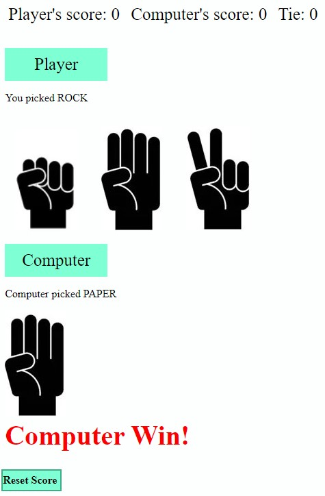

# Rock🪨 Paper📃 Scissors✂️
## Introduction:  
A very popular game among youngsters. This is a very easy game to play. In this application, scores are being tracked. Player will be able to see how many time they win against computer or tie. Player also have the option to reset score and start over again.  
*******
HERE IS THE LINK TO GAME. [ROCK-PAPER-SCISSORS](https://luckylobster25.github.io/Rock-Paper-Scissor/)  
*******

## Tool used: 
Everything in this project are done using HTML, CSS and Front-end Javascript. No packages are used. 
## Contribution:  
This is a individual project created by Chue Chang. You are than welcome to improve this application.  
